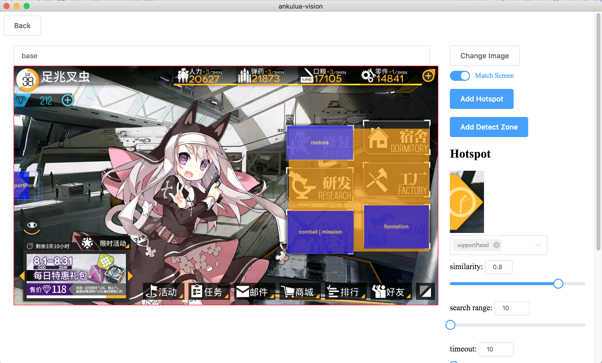

# ankulua-vision

> An electron app to help making [AnkuLua](https://play.google.com/store/apps/details?id=com.appautomatic.ankulua.trial) scripts.

**You need AnkuLua to use the scripts generated by this app**

AnkuLua:
> AnkuLua is an Android app that focus on the automation of any Android app.
> The basic operations are:
>   * take screen snap shop and look for specific image on the screen 
>   * take some actions (such as click, drag and drop and etc.) based on the searching result
Read more: http://ankulua.boards.net/thread/2/ankulua-introduction

#### Download

https://github.com/binux/ankulua-vision/releases

#### How to use



1. Run the app, select your work folder for the script.
2. Add screen capture of the game by clicking `Add Screen` or drag and drop into the window.
3. Name the screen like `base`, `battle`, `mission`
4. Click `Add Detect Zone` and drag and draw the region that can be used to identify the screen.
  * You could adjust the similarity required or search range if the position may changes.
  * If you are detecting a popup dialog that partly overlaying on another screen, make sure add more detect zones than the lower layer screen. Otherwise it may detected as the screen below the dialog.
5. Click `Add Hotspot` and drag and draw the region that can be clicked, and list all possible screens it may link to.
  * You could adjust the similarity and search range like detect zone.
  * You could use them later in your lua script (see below).
  * After region created, you can double click it and jump between screens.
6. `Back` and `Save & Generate`
7. Start editing your script `<WORK_FOLDER>/start.lua`

#### Script & APIs

Edit the script `<WORK_FOLDER>/start.lua` with your favorite editor.

It's basically a AnkuLua script written in lua language. You could find more information from [here](http://ankulua.boards.net/thread/2/ankulua-introduction) or [here in Chinese](http://ankulua-tw.boards.net/thread/2/ankulua)

##### stateMachine:goto(...)

Goto one or more screens/states. Example: `stateMachine:goto('base', 'mission', 'battle', 'missionResult');`

Return: last state

##### stateMachine:find([region], image, [timeout])

Find `image`, you could use the `file` generated by ankulua-vision, if you do so, `find` method will respect the similarity and search range you set. If `timeout` set, it will wait up to `timeout` seconds before return `nil`. Example: `stateMachine:find('btn_base_combat', 10)`

Return: [Match Object](http://ankulua.boards.net/thread/6/objects-methods-introduction-sikuli-compatible) or `nil`

##### stateMachine:dragFind(image, down, left)

Drag the screen and find the `image`. `down > 0` drag down, `down < 0` drag up, `down = 0` drag up then down. `left > 0` drag left, `left < 0` drag right, `left = 0` drag right then left

Return: [Match Object](http://ankulua.boards.net/thread/6/objects-methods-introduction-sikuli-compatible) or `nil`

##### stateMachine:click(image, [timeout])

Click on `image`, if `image` is a `file` generated by ankulua-vision, it will respect the setting, and try to match the `image` before click, you could set similarity to 0 by skip image matching and always click the region. if `timeout` set, it will wait up to `timeout` seconds before return `nil`.

Return: true if success

##### stateMachine:zoomOut()

##### stateMachine:checkState(state)

Return: score if match given state

##### stateMachine:getState()

Return: current state

##### stateMachine:leaveState(state, timeout=10)

Wait until leave state

Return: true if success

##### stateMachine:waitStates(states, [timeout])

Wait until enter state or states, example: `stateMachine:waitStates({'base', 'battle'})`

##### stateMachine:plan(state, target)
##### stateMachine:play(state, target)

##### stateMachine:register(state, target, action)

Register an `action`(type: function) from `state` to `target`, `target` could be a name of existing screen or a new screen. You can `stateMachine:goto` the `target` screen you defined here. It can be used to defined complex state transfers or short cuts. `action` is a function, and must return a known state name. Example:

```
stateMachine:register('mission', 'mission_43e_select', function ()
  stateMachine:log('select mission')
  stateMachine:click('btn_mission_mission_ep04.png', 2)
  stateMachine:click('btn_mission_emergency.png', 2)
  if not stateMachine:click('btn_mission_ep04_emergency_combatSetting.png', 3) then return end
  return stateMachine:waitStates("combatSetting")
end)

stateMachine:goto('mission', 'mission_43e_select', 'combat')
```

##### option: 

```
stateMachine.highlightTime = 0.3
stateMachine.highlightFind = true
stateMachine.highlightClick = true
```


#### Build Setup

``` bash
# install dependencies
npm install

# serve with hot reload at localhost:9080
npm run dev

# build electron application for production
npm run build
```

---

This project was generated with [electron-vue](https://github.com/SimulatedGREG/electron-vue)@[fad1966](https://github.com/SimulatedGREG/electron-vue/tree/fad1966ffb4b7f27639e224bbbebf349f7ef7d8a) using [vue-cli](https://github.com/vuejs/vue-cli). Documentation about the original structure can be found [here](https://simulatedgreg.gitbooks.io/electron-vue/content/index.html).
